path: tree/master/docs/
source: flightTutorial.md

# 787 Full flight tutorial
A getting-started tutorial, detailing the main steps to make your first flight in the Magknight **787**: Aviator's Edition. It doesn't include details on using the EFB for performance data, or how advanced systems work.
## Route Information
**All weights are given in METRIC units**
### Departure Airport
- EGLL - London Heathrow Airport
- Stand 552
### Route  
```WOBU3F WOBUN WELIN UT420 TNT UN57 POL UN601 RIBEL LIBA2A```

### Destination Airport
- EGPF - Glasgow Airport

## Settings and Configuration


Before loading the **787**: Aviator’s Edition, It is required that you activate the
‘Use experimental flight model’ checkbox located on the general tab of X-Plane’s
settings. Failure to do so will cause some flight performance irregularities
including the inability to rotate or flare. Fuel burn will also be greatly
impacted leaving the possibility of running out of fuel in cruise and ending up
in Manchester. *Nobody wants to end up in Manchester.*

## Aircraft Startup  
### Cold and Dark

If you step into an aircraft in a ‘Cold and Dark’ state then you will have to
assume it was sat for a while. This requires several extra checks before jumping
in and getting the bird powered as opposed to an already powered aircraft.

First, verify that the engine master switches are in the ‘Cutoff’ position.  


Then, check the landing gear lever is in the down position.


Once you’re done, head to the overhead panel and select the ‘Battery’ push
button.


The screens will now power on. Follow this by pressing the ‘GEN CTRL’ push
buttons. The four buttons are located at the very bottom of the electrical
panel.


Proceed to the panel above the Battery switch where you will be presented by two
IRS knobs, Select both of these to the ‘ON’ position. A light saying ‘ON BAT’
should light up then extinguish after several seconds.


After this is completed, head down to the lighting panel. This is located at the
very bottom centre of the Overhead panel. Press the ‘NAV’ push button to turn on
the navigation lights and turn the Seatbelts sign knob to the ‘AUTO’ or ‘ON’
position.  


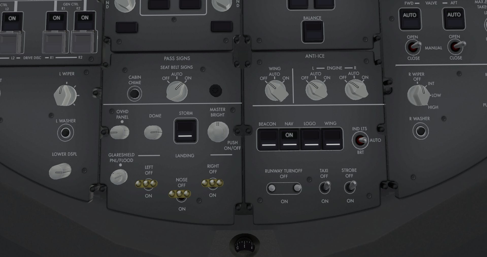

We are now risking a battery fire by powering everything from the batteries, so
to keep the company happy, we’ll call for a GPU. To do this, head to the EFB.
The EFB is located on the left of the Captains Primary Flight Display (PFD).
Press the ‘PWR’ key found on the very top right of the unit to turn it on.

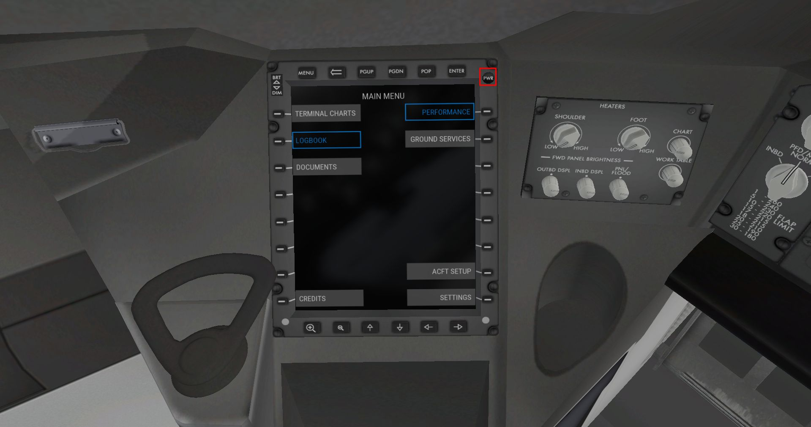

You will be presented by a plethora of pages. We’ll explain what all the pages
do later in the tutorial, for now just select ‘GROUND SERVICES’ then ‘GPU1’ on
the right hand side. This will show a blue diamond and have blue text. Select it
and it will turn Magenta showing the Ground Power Unit is connected. You can
verify this by looking outside.


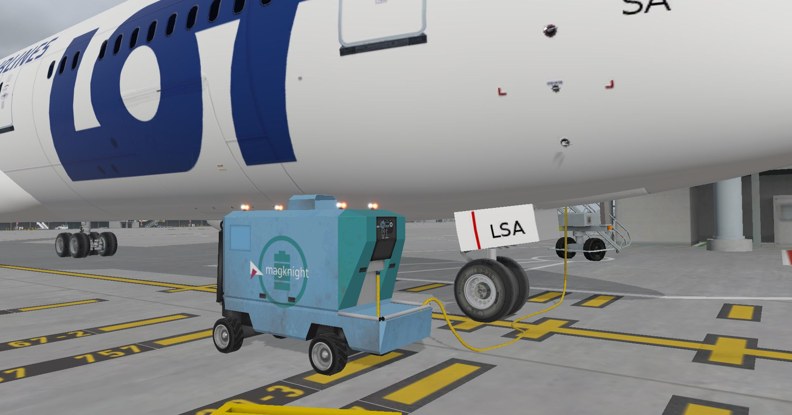

With this connected, you can head back up to the electrical panel. A white light
saying ‘AVAIL’ will now be showing on the Push button for ‘FWD EXT PWR L’. Press
this button to activate the ground power; and stop the company safety executives
from going mad. It’ll also allow more systems to power up in the background.

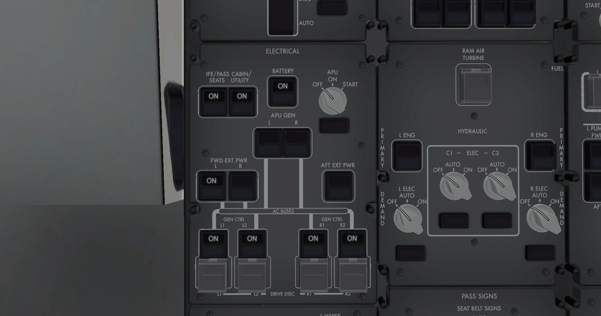

Now that the GPU is attached, we can turn on the power that makes the passengers
happy. Click ‘IFE/PASS SEATS’ and ‘CABIN/UTILITY’ located left of the battery
button to turn on the entertainment systems, and coffee machine.


Next, we need to turn up the brightness lighting of the MCP so we can use the
autopilot. Turn the outer knob of the ‘GLARESHEID PNL/FLOOD’ knob on the
lighting panel to the full right position.


### Cockpit Preparation

Now it is time for us to fuel up, We will need 11.8 tonnes (11800kg) of fuel.
Try to match these numbers in the X-Plane weights and balance menu.  


Upon refueling, Head back to the Overhead Panel and go to the fuel panel. This
is located above the lighting panel. You will need to press ‘L PUMPS FWD/AFT’,
‘CENTER PUMPS FWD/AFT’ and ‘R PUMPS FWD/AFT’. The ‘BALANCE’ button
below the Centre Tanks needs to remain OFF. This will prevent the engines from
starting if the PushButton is selected to on. 


## Flight Management Computer (CDU)

It is now time to program the FMC, These are located above the throttle quadrant
and below the landing gear lever from earlier. Start off by mashing ‘CLR’ to
clear off any messages and unlock the scratchpad.

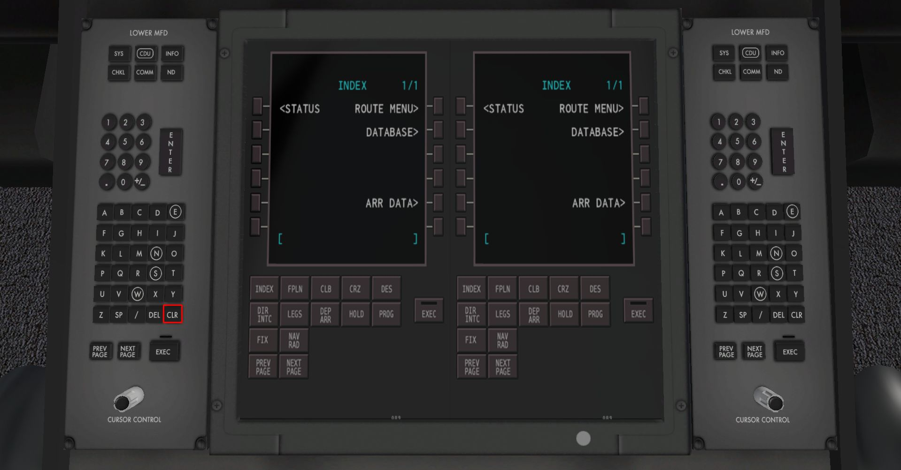

Click ‘FPLN’ now and fill in the page as shown in the screenshot below using the
keyboards provided on either side.

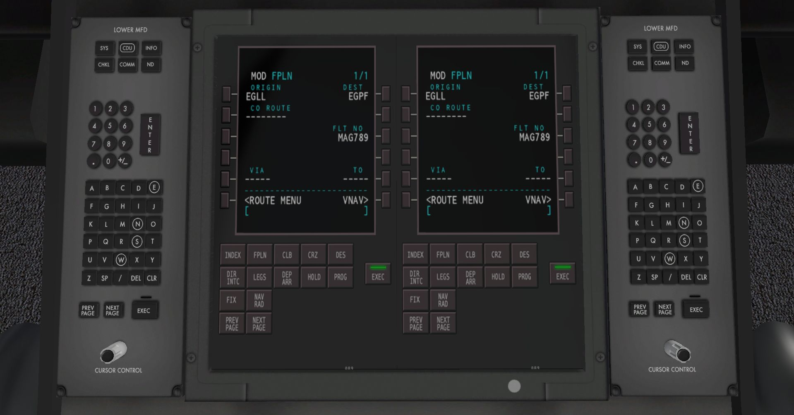

Upon completing this, you will see the ‘EXEC’ button with a green light. Press
this. Now fill in the VIA and TO text boxes at the bottom as shown below and
press ‘EXEC’ again. Do not write DIRECT, Just leave these boxes blank,
Autofilling is great.


Click ‘NEXT PAGE’ then fill in the following pages as follows and press ‘EXEC’
once you finish.


Click on VNAV then fill in the following pages as below. Click ‘NEXT PAGE’ to
cycle through them.

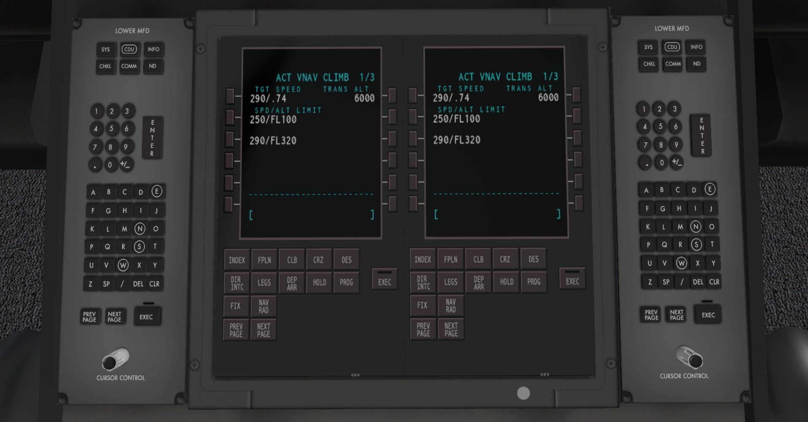


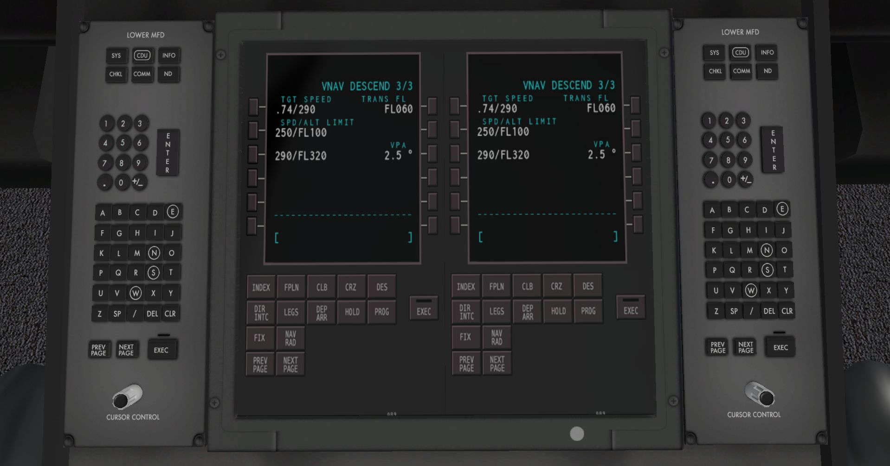

After doing this, Press ‘DEPARR’ and you will be greeted by this screen, Click
DEP on the Top left.


Use Next page to navigate this screen. Select WOBU3F and Runway 09R then click
‘EXEC’

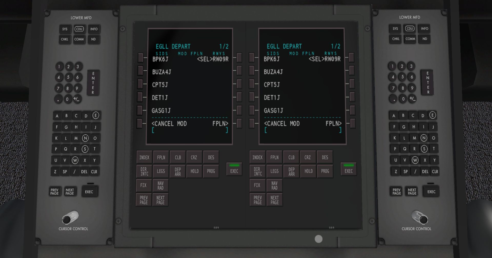

The FMC is now programmed. Time for an in depth EFB explanation. Click the
‘MENU’ key on the top left to return to the front page then click on ‘TERMINAL
CHARTS’, Fill in the page as shown below.


Press the ‘MENU’ key again and click on ‘PERFORMANCE’ located on the right side
of the screen. You will see this screen, It may look daunting at first but bear
with me! The departure airport is prefilled so this is okay, In the dropdown
below “EGLL”, select runway 09R (as this is our departure runway). Follow this
up with selecting the ‘DAMP’ condition. Put “270/5” in the ‘WIND’ box, Click
‘SHOW KYBD’ on the left to input. Click Flap 15 for takeoff and A/I to off. On
the bottom of the screen you will see a C/G and weight box. Input ‘175000’ into
weight and 25 into C/G. Select TO-1 in the ‘RTG’ box and fill “55c” into the
‘ATM’ box.


After this, Click ‘CALC’. The performance data will appear at the bottom of the
page; of interest here are V1, VR and V2. These values are automatically sent to
the PFD. Now you should head to the Autopilot panel. Turn on the Flight
Directors then set the SPD knob to the V2 speed in the EFB.


Now, head to the overhead panel. Next to the battery switch is the APU knob.
Turn this to start. A fault light will now turn on. The APU is now starting.


Once the APU is powered up, OFF will show on the APU GEN buttons, Click these,
You can monitor the startup on the EFIS/STAT page.  


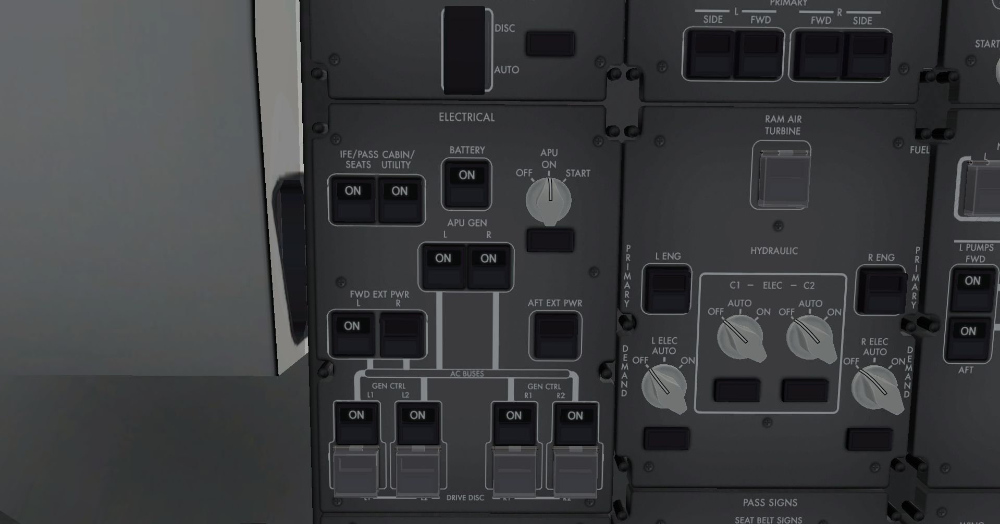


On the overhead panel, Select the ‘BACKUP’ buttons located on the ‘WINDOW HEAT’
panel followed by the four PRIMARY’ marked buttons below.


Next you need to head to the panel below this one and turn all the knobs to
‘AUTO’ followed by pressing the ‘L/R ENG’ push buttons.

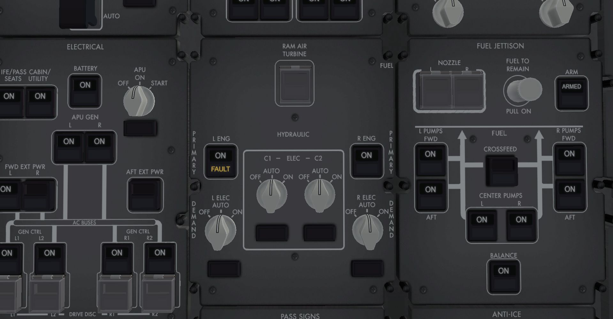

Now that we’ve got our own power online, we should stow our folding trays, and
GPU. TO do this, click the “FWD EXT PWR” button as before, and remove the GPU in
the EFB GROUND SERVICES page. Failing to do so voids the warranty on the GPU.


Return to the lighting panel and turn the ‘BEACON’ and ‘LOGO’ push buttons to
on.


Now, return to the EFB and select the ‘GROUND HANDLING’ page. Select ‘PLAN
PUSHBACK’, Place the plane in a similar location to below then press the ENTER
key on your keyboard.


In the EFB, Press ‘CONNECT TUG’ and follow the usual BetterPushback commands.


As the Tug does its thing, Head to the AIR panel which is right of the
Hydraulics panel and turn everything on: Trim air, Both packs, The Recirc fans
and the EQUIP cooling.


## Engine Start and Taxi

Now it is time to push back and start the engines. With the tug connected,
release the brakes when requested. Start by checking the beacon light is on then
head to the throttle quadrant. We will be starting engine two first, then engine
one. Flick the engine two fuel control switch to on.


Follow this up by clicking the R ENG start switch, This will pop back when the
engine startup is complete.


Once the right engine is started, do the same for the other engine. The 787 is
able to start both engines simultaneously when using APU power, for the
situations where you’re running late.

Once you confirm both engines are on and stable at idle, the switches have
pinged back to their ‘NORM’ position and the tug is disconnected, switch the APU
off by turning the APU master switch to ‘OFF’. Remember to turn off the APU
generators too.

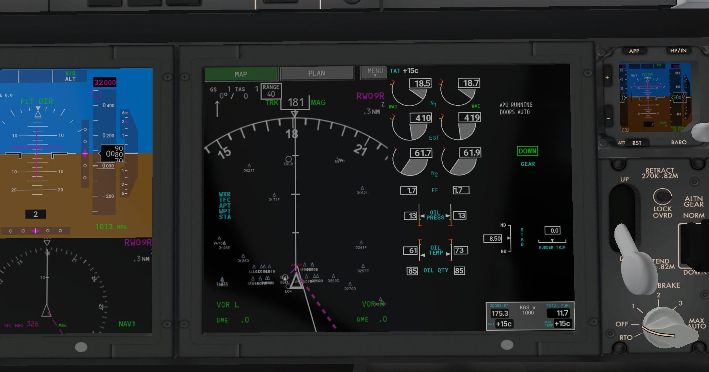


Once this is complete, Do your flight controls check:  
  
Full left,


Full right,


Full up,


Full down,


Rudder left,


Rudder right,


Then lower the flaps to ‘15’


Turn on the transponder, This is located behind the engine master switches.


Now kick off the brakes, turn on the taxi light and taxi to the runway.


## Takeoff and Initial Climb

Once at the runway, Turn on the landing, runway turnoff and strobe lights,


Set autobrake to RTO


And start the clock


Takeoff as normal, be sure to not rotate past 7 degrees or you will risk a tail
strike. The -9 has been designed to be way too low for its landing gear. The
engineers weren’t really paying much attention at the time.


Once in the air, Raise the gear at around 200ft.

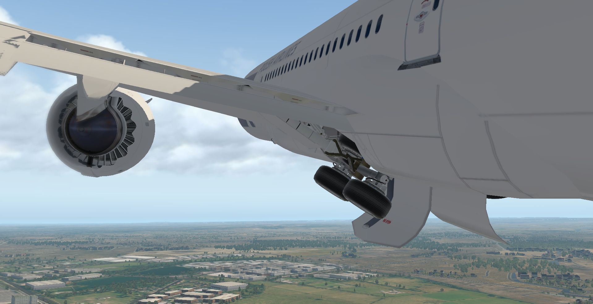

Passing 500ft, click LNAV on the Autopilot followed by LEFT side A/P button.
Passing 1000ft, enable VNAV (alternatively, you can use manual FLCH or VS climb,
which is especially useful when flying on VATSIM, due to all the altitude
restrictions on the Heathrow departures.


Remember to raise the flaps as you accelerate.


As you pass 6000ft (transition altitude), Select ‘STD’ on the left and right
altimeters. The button to do so is located next to the Autopilot.


At 10,000ft, Turn off the landing lights, taxi lights and logo lights.

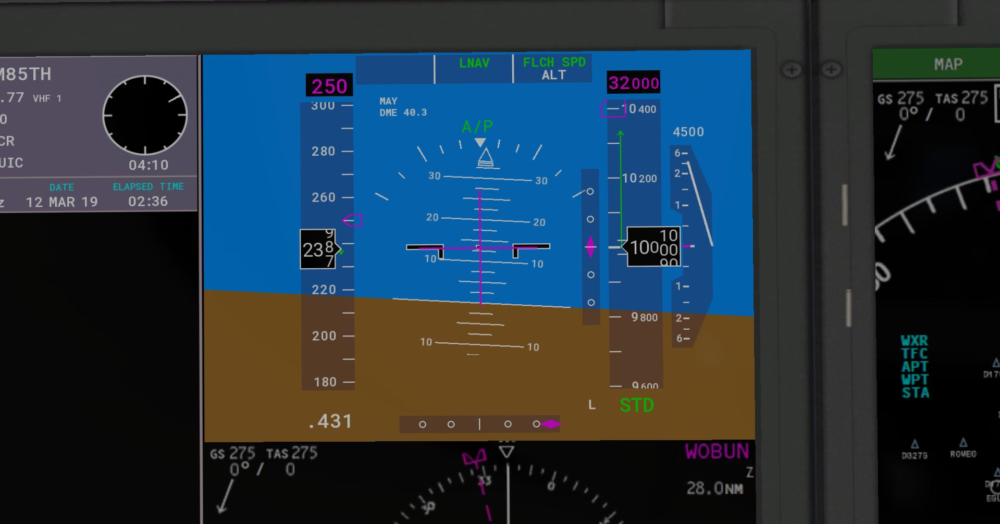

You can also turn the seatbelt signs off at this moment.


## Descent Preparation

In the FMC, hit the ‘DEP APP’ button then ARR on the bottom right.


Select the LIBA2A arrival, ILS23 for the runway and GLW for the transition then
select ‘EXEC’


Set your minimums on the same panel as the altimeter mentioned before; for this
approach they should be 200ft RADIO.


Now you can select your autobrake, Because Glasgow isn’t the longest runway, we
will use Autobrake ‘3’


Upon nearing the top of descent, dial the autopilot altitude down to the ILS
intercept altitude (platform altitude); In this case that would be 2800ft.

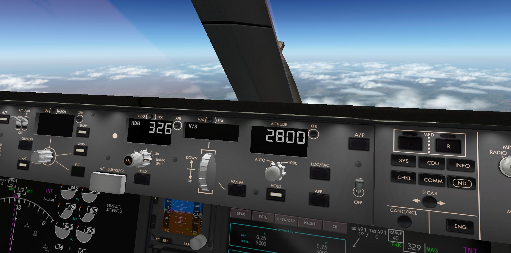

## Descending

Once at T/D, Click ‘FLCH’ to start heading down

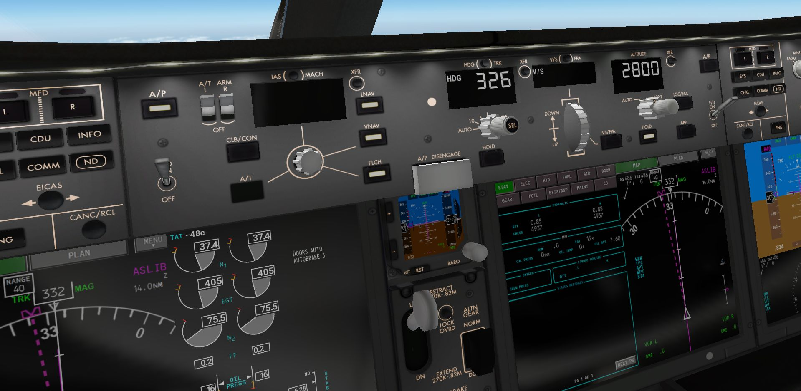

Arm the spoilers by setting the lever to ARMED


Passing 10,000ft, Turn on the landing lights and seatbelt sign.


After doing this, head to ‘RAD NAV’ in the FMC and type in 110.10 and input this
into NAV1 and again into NAV2.

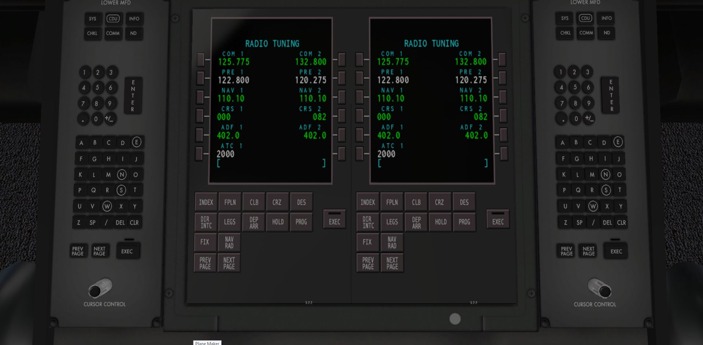

## Approach

As you make your approach, deselect VNAV and LNAV on the autopilot, Select LOC
when the localiser connects then manually slow down. In our case the landing
speed is 149kts.


Once the vertical aspect (glideslope) of the ILS connects, Press APP.

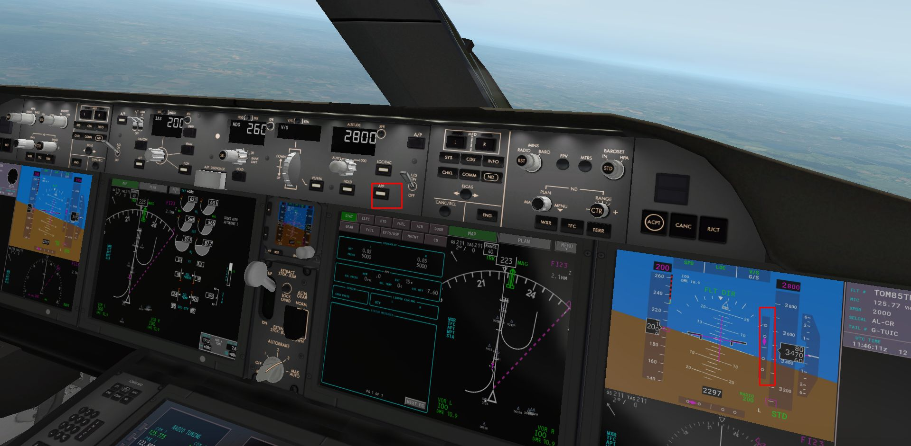

Fly along the ILS until 1000ft, From here take it manual and place her onto the
runway. Warning, the 787 is easy to float. Try to land the plane better than
Alex; it’d be best not to need a full set of new tyres and suspension before the
next departure.


## After Landing / Taxi To Gate

Once vacated, lower the spoilers and raise the flaps.


Go to the lighting panel and turn off the landing lights, strobe and in its
place, turn on the taxi lights and logo light.


Head to the electrics panel and turn on the APU,


Once the APU is on, Press the Generators then turn off Engines ones master
switch, We will be doing a single engine taxi.

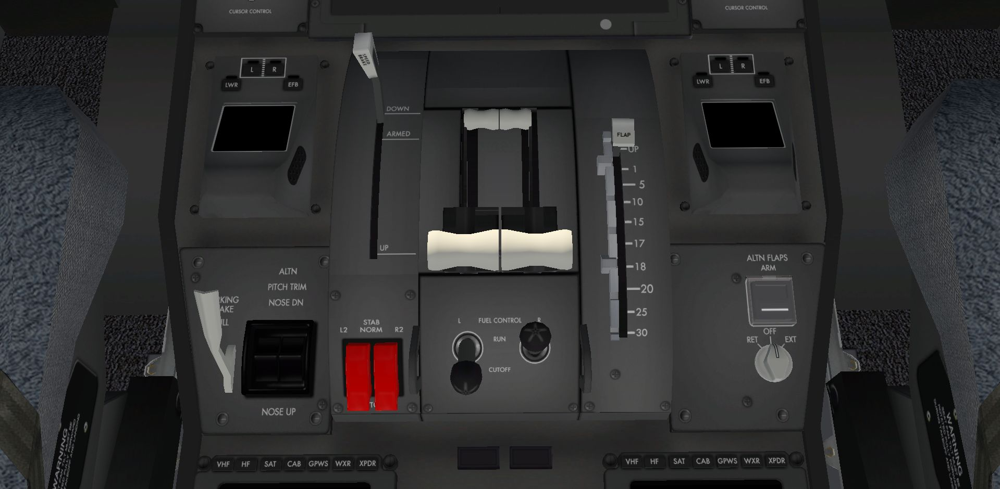

When nearing the gate, Turn the taxi lights off.


## Shut Down

Upon arrival into the gate, set the parking brake then flick the engine master
switches to OFF. We recommend starting the APU before doing this, to avoid the
cabin going dark, and the passengers screaming.


When the N2 of the running engine drops below 30, you can turn the beacon lights
off along with the seatbelt signs.


Now for the fun, On the air panel, Turn the trim air, packs, equipment cooling
and recirc cooling off. On the Hydraulics panel you need to turn off all the
knobs and the engine pumps, The fuel pumps can then be switched off followed by
the window heating.

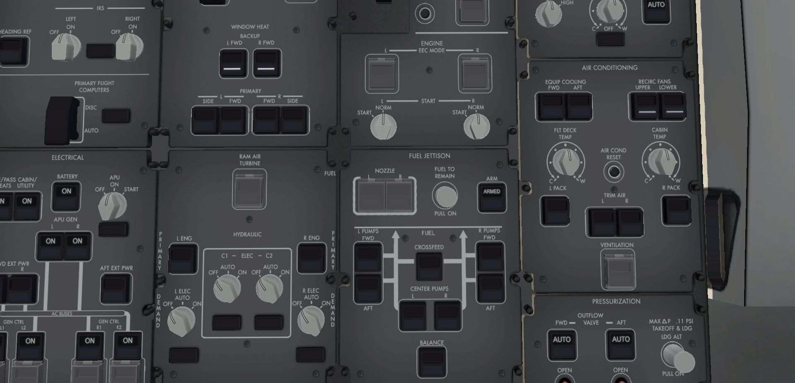

You can now turn the IRS off,

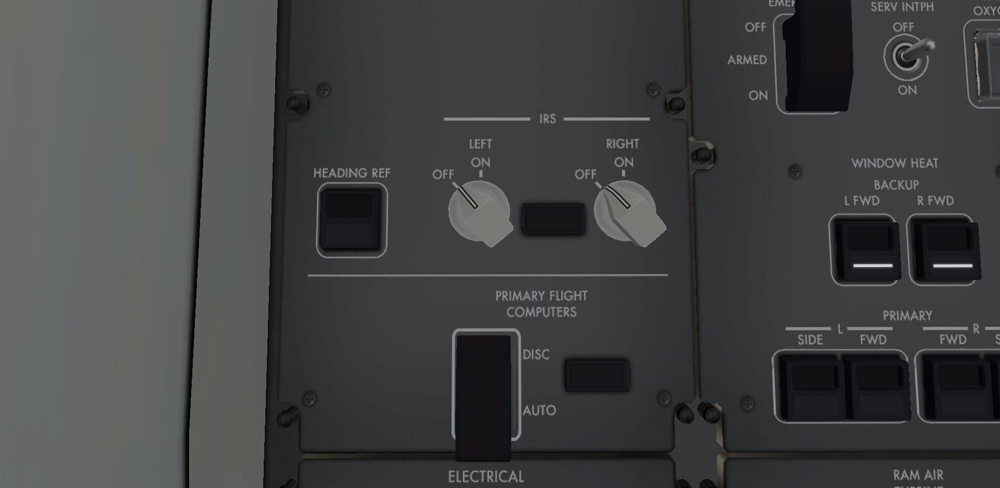

You now can turn the cabin amenities located next to the battery switch once
your passengers are on their merry way,


Turn off the logo and nav lights,


Then disable the APU generators followed by the four ‘GEN CTRL’ buttons. After
this, turn the APU master switch to off.


Once the APU is off, Turn the battery off.


You have successfully completed your first Magknight 787 flight,
Congratulations! The recommended landing rate of a 787 is -180fpm, I scored a
-30fpm landing rate, try and beat me.


